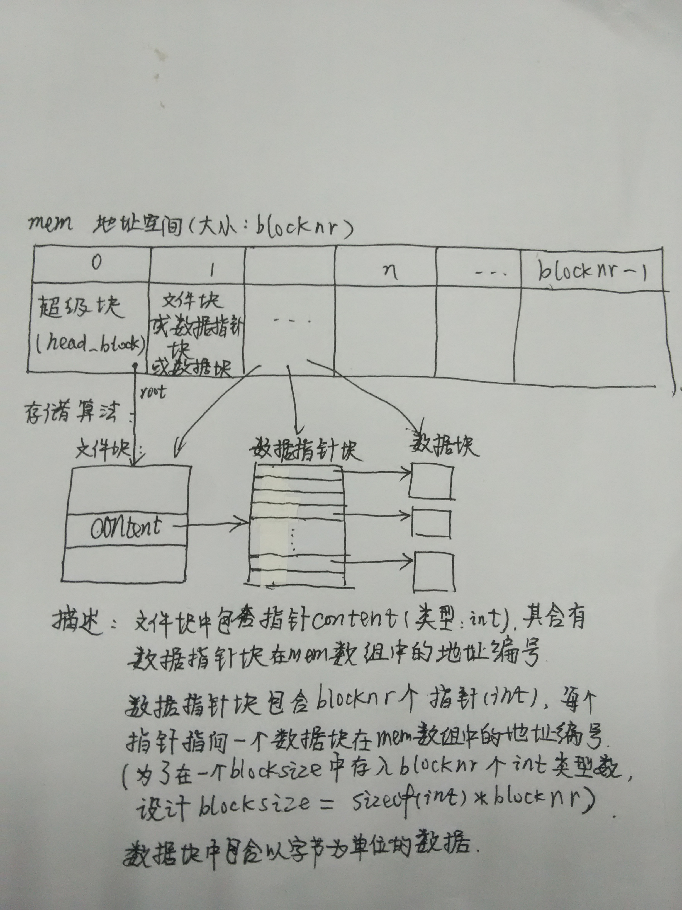

# 实验报告

## 存储结构
如下图所示


## 结构优点

由于性能方面的考虑，采用上述结构。针对助教在实验三文档中提出的性能问题，具体解决为：
*首先是过多的链表操作。比如如果对于文件的随机读写请求都需要遍历以便读写位置前的链表所有节点，是否存在效率问题。*

通过数据块指针来索引每一个数据，可以直接计算得到随机读写地址，不需要遍历链表节点，可以大幅提升效率。


*其次是对齐。如果将每个block作为链表的一个结点，那么一个block实际存储的信息便不是一个整数，比如对于4KiB的block文件系统，那么每个block会存储3.9KiB的文件内容和一个next指针，这对一些期望文件物理对齐的应用不友好，比如一个存储raw格式的虚拟磁盘，在其上还有一个文件系统的情况。*

在对齐方面，数据块指针和数据都做到了很好的对齐，不仅对于物理对齐友好，而且紧致的存储能够减少内存碎片。（通过设计数据块大小，使得一个数据块中刚好能存入blocknr个“指针”，紧致且便于寻找;而将数据指针块与filenode分开，可以减小filenode的大小，从而保证所有类型的块都<blocksize，且尽量用尽blocksize)

此外，将root,last_applied等存入超级块（事实上root只是一个为了方便而偶尔存在的变量），所有信息可以从地址空间中复现


##实现功能
ls
echo helloworld > testfile
cat testfile

```
*注意事项* 
因为个人时间安排翻车，最后仅对echo,cat测试成功，大文件写入会出错，但是我在规定时间内没有能debug出来了。
烦请助教看看算法。。
上周的版本可以进行大文件写入，但是root,last_applied等都没有存入地址空间，结构也没有本次清晰，高效，空间利用率也不如本次高。
         


